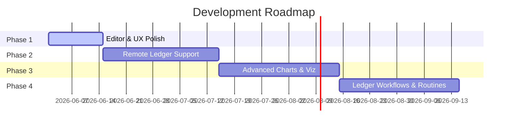

# Project Roadmap

This document outlines the current status, active developments, and future plans for the **Beancount Ledger** (Obsidian Finance Plugin). 

> [!NOTE]
> This roadmap is a living document and represents our planned direction. Priority and scope may shift based on user feedback and Obsidian API changes.

---

## 🗺️ Release Phases

---

## ⚡ Active Development (Current Cycle)

### Phase 1: Editor & UX Polish (v2.1.x)
Focusing on refining the local editing experience, resolving security/community guidelines feedback, and standardizing styling.

- [ ] **Community Review Security Fixes**
  - Refactor vault enumeration (`vault.getFiles`, `getMarkdownFiles`) to adhere to community review recommendations.
  - *Reference:* [#205](https://github.com/mkshp-dev/obsidian-finance-plugin/issues/205)
- [x] **Design Token System**
  - Establish a unified token system in `styles.css` for consistent spacing, colors, and typography across Svelte views.
  - *Reference:* [#84](https://github.com/mkshp-dev/obsidian-finance-plugin/issues/84)
- [ ] **Transaction Table Improvements**
  - Enhance transaction filtering, multi-column sorting, and column visibility options.
  - *Reference:* [#86](https://github.com/mkshp-dev/obsidian-finance-plugin/issues/86)
- [ ] **Overview Tab Layout Polish**
  - Redesign KPI cards on the Overview dashboard to support flexible grids and better layout on narrow screens.
  - *Reference:* [#85](https://github.com/mkshp-dev/obsidian-finance-plugin/issues/85)
- [x] **Loading & Error States**
  - Standardize spinners, placeholders, and error banners across all dashboard tabs.
  - *Reference:* [#87](https://github.com/mkshp-dev/obsidian-finance-plugin/issues/87)

---

## 📅 Upcoming Phases

### Phase 2: Remote Ledger Support (v2.2.0)
Enabling users to interact with hosted Beancount files or backend instances without requiring a local Python environment.

- [ ] **Settings Integration**
  - Add configuration inputs for remote server URLs, API paths, and authentication tokens (e.g., Bearer tokens).
  - *Reference:* [#76](https://github.com/mkshp-dev/obsidian-finance-plugin/issues/76)
- [ ] **HTTP BQL Query Runner**
  - Build a remote query executor client that communicates via REST APIs instead of spawning local `bean-query` processes.
  - *Reference:* [#77](https://github.com/mkshp-dev/obsidian-finance-plugin/issues/77)
- [ ] **Error Fallbacks**
  - Implement smart retry logic and offline caching indicators when remote connection drops.
  - *Reference:* [#78](https://github.com/mkshp-dev/obsidian-finance-plugin/issues/78)

### Phase 3: Advanced Charts & Visualizations (v2.3.0)
Bridging the visualization feature-gap between Fava and Beancount Ledger inside Obsidian.

- [ ] **Account Hierarchy Treemap**
  - Render a responsive treemap chart showing asset/expense distributions across nested accounts.
  - *Reference:* [#82](https://github.com/mkshp-dev/obsidian-finance-plugin/issues/82)
- [ ] **Balance Sheet Icicle Chart**
  - Add an icicle hierarchy chart for visualizing deep balance sheets.
  - *Reference:* [#95](https://github.com/mkshp-dev/obsidian-finance-plugin/issues/95)
- [ ] **Balance History & Price Trends**
  - Build per-account historical balance charts (`#97`) and commodity historical price line charts (`#99`).
  - *Reference:* [#97](https://github.com/mkshp-dev/obsidian-finance-plugin/issues/97), [#99](https://github.com/mkshp-dev/obsidian-finance-plugin/issues/99)
- [ ] **Fava Charts Parity Review**
  - Audit and implement missing chart styles from Fava.
  - *Reference:* [#79](https://github.com/mkshp-dev/obsidian-finance-plugin/issues/79)

### Phase 4: Ledger Workflows & Routines (v2.4.0)
Adding interactive bookkeeping workflows directly inside Obsidian.

- [ ] **Overview Time Filtering**
  - Add an interactive date range picker to filter historical views, dashboards, and KPI metrics.
  - *Reference:* [#105](https://github.com/mkshp-dev/obsidian-finance-plugin/issues/105)
- [ ] **CSV Import Assistant**
  - Introduce a step-by-step importer view to convert bank/credit CSV exports to Beancount transactions.
  - *Reference:* [#91](https://github.com/mkshp-dev/obsidian-finance-plugin/issues/91)
- [ ] **Ledger Balancing Assistant**
  - Create a balancing helper view to walk users through asserting account balances against bank statements.
  - *Reference:* [#90](https://github.com/mkshp-dev/obsidian-finance-plugin/issues/90)
- [ ] **Duplicate Transaction Detector**
  - Automatically scan and flag duplicate entries based on date ranges, amounts, and payees during imports.
  - *Reference:* [#89](https://github.com/mkshp-dev/obsidian-finance-plugin/issues/89)

---

## ✅ Completed Milestones

### v2.0.0 — Security & Compatibility (June 2026)
- **Vault-only Ledger:** Replaced all direct filesystem (`fs`) dependencies with Obsidian's native Vault adapter API.
- **CLI Security:** Shifted all child process executions to secure parameterized `spawn` calls, avoiding shell injections.

### v1.6.0 — Editor Enhancements (May 2026)
- **Inline Linting:** Integrated `bean-query .errors` to show real-time editor syntax errors.
- **Directive Snippets:** Implemented snippet autocompletions for all major directives.
- **Smart Formatting:** Built standard auto-indentation and document formatting tools.
- **Autocomplete:** Added tag, link, narration, account-name, and commodity completions.

---

## 💬 Feedback & Suggestions

Have a feature request or bug report not listed here?
- Open a new [GitHub Issue](https://github.com/mkshp-dev/obsidian-finance-plugin/issues/new/choose)
- Discuss ideas in our [Discussions](https://github.com/mkshp-dev/obsidian-finance-plugin/discussions) tab
